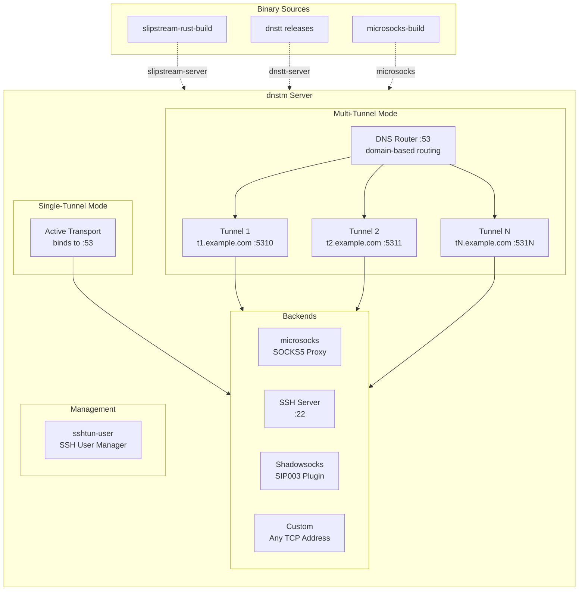
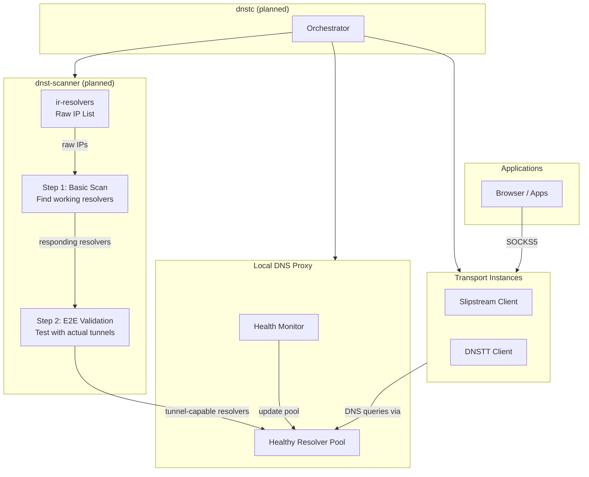
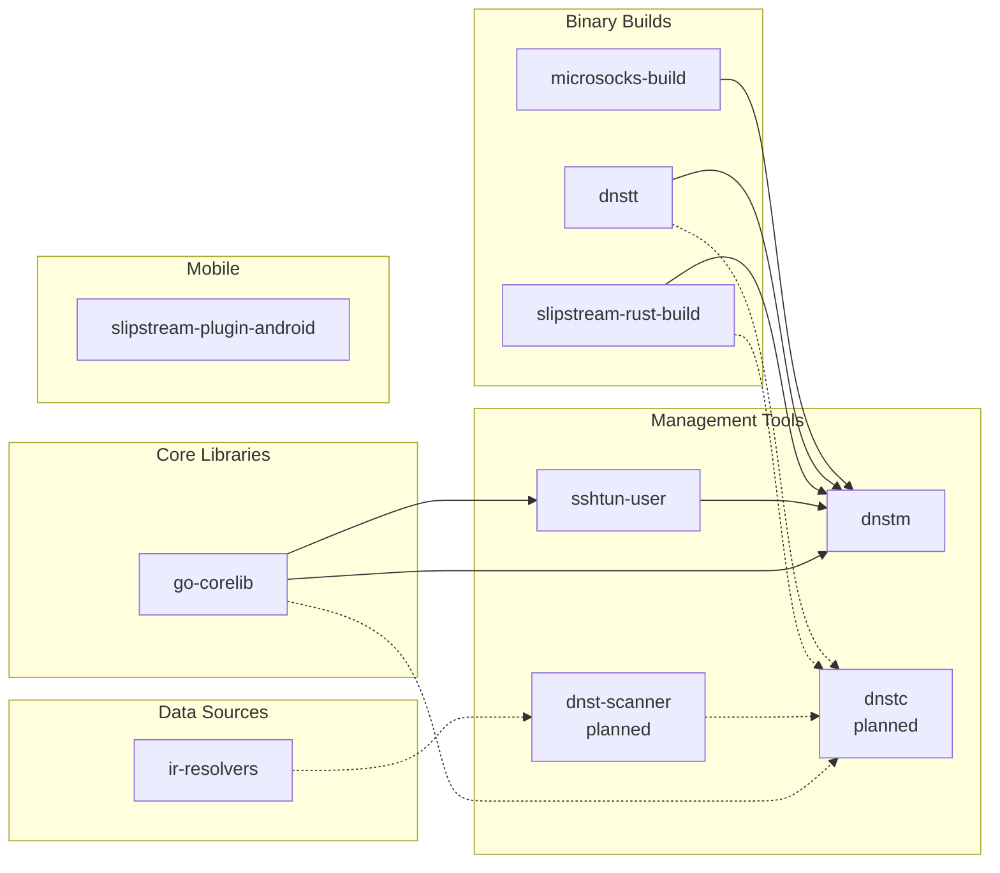

# Net2Share

We are a group of independent developers working to bring light to Iran and help people stay connected during the ongoing digital blackout. **You are not alone!** 🫂

While our current focus is on supporting the people of Iran, Net2Share is dedicated to enabling internet access for users in any highly restricted and censored networks around the world.

## Current Focus

At the moment, DNS-based tunnels are among the few methods that remain effective in Iran, so this is where we're concentrating our efforts.

## Architecture Overview

### How DNS Tunneling Works

DNS tunneling encapsulates data within DNS queries and responses, allowing traffic to pass through networks that might otherwise block it. The client sends data encoded in DNS queries to a recursive resolver, which forwards them to an authoritative DNS server under our control, where the tunnel server decodes the traffic and routes it to the open internet.

```
┌──────────────────────────────────────────────────────────────────────────┐
│                         Restricted Network (Iran)                        │
│                                                                          │
│   ┌────────────┐      DNS Queries       ┌───────────────────┐            │
│   │   Client   │ ─────────────────────► │ Recursive DNS     │            │
│   │  (dnstc)   │ ◄───────────────────── │ Resolver (Iran)   │            │
│   └────────────┘      DNS Responses     └─────────┬─────────┘            │
│                                                   │                      │
└───────────────────────────────────────────────────┼──────────────────────┘
                                                    │
                                          DNS Queries (forwarded)
                                                    │
                                                    ▼
┌──────────────────────────────────────────────────────────────────────────┐
│                             Open Internet                                │
│                                                                          │
│                      ┌───────────────────────────┐                       │
│                      │ Authoritative DNS Server  │                       │
│                      │ + Tunnel Server (dnstm)   │                       │
│                      └─────────────┬─────────────┘                       │
│                                    │                                     │
│                                    ▼                                     │
│                           ┌───────────────┐                              │
│                           │ Open Internet │                              │
│                           └───────────────┘                              │
└──────────────────────────────────────────────────────────────────────────┘
```

## Our Projects

### Core Tools

#### [DNS Tunnel Manager (dnstm)](https://github.com/net2share/dnstm)

A CLI tool to deploy and manage DNS tunnel servers on Linux. Run single tunnels or scale with the built-in DNS router for multi-tunnel setups.

- Two operating modes: single-tunnel (one active) and multi-tunnel (DNS router with domain-based routing)
- Transports: Slipstream (high-performance, TLS) and DNSTT (Curve25519 encryption)
- Backends: SOCKS (built-in microsocks), SSH, Shadowsocks (SIP003 plugin), Custom (any TCP address, e.g., MTProxy)
- Auto-generated TLS certificates (Slipstream) and Curve25519 keys (DNSTT)
- Interactive menu and full CLI support
- Config file management: load, export, and validate configurations
- systemd service management with security hardening
- Firewall configuration (UFW, firewalld, iptables)
- SSH tunnel user management via integrated sshtun-user

#### [DNS Tunnel Client (dnstc)](https://github.com/net2share/dnstc) — _Coming Soon_

A cross-platform client tool for connecting to DNS tunnel servers from restricted networks. Supports Windows, macOS, and Linux.

**Planned features:**
- Download and configure Slipstream and DNSTT transports
- Install Slipstream as a Shadowsocks SIP003 plugin with Shadowsocks client
- Discover working recursive DNS resolver IPs using dnst-scanner
- Continuously monitor resolver health and maintain a pool of working resolvers
- Run a local DNS proxy with load balancing across multiple resolvers
- Run multiple transport instances with load balancing for higher aggregate bandwidth
- Orchestrate the entire flow between scanner, DNS proxy, and transports

#### [DNS Tunnel Resolver Scanner (dnst-scanner)](https://github.com/net2share/dnst-scanner) — _Coming Soon_

A tool designed to scan and identify recursive DNS servers in Iran that are compatible with DNS tunneling. Provides an end-to-end solution for finding working resolver IPs that can be used to establish DNS tunnels like DNSTT and Slipstream.

**Planned features:**
- Two-step scanning: basic scan to find working resolvers, optional E2E validation with actual tunnels
- Multi-domain testing: normal domains (google.com, microsoft.com), blocked domains (facebook.com, x.com), and custom tunnel domain
- Resolver classification: `clean` (properly resolves blocked domains) vs `censored` (hijacks to 10.x.x.x)
- E2E validation (optional): test resolvers with actual Slipstream/DNSTT client connections

#### [Iran Resolvers (ir-resolvers)](https://github.com/net2share/ir-resolvers)

A curated list of potential recursive DNS server IP addresses available within Iran's intranet (Filternet). dnst-scanner fetches its initial raw list from this repository.

#### [Slipstream Shadowsocks Android Plugin](https://github.com/net2share/slipstream-plugin-android)

A fork of the upstream [slipstream-plugin-android](https://github.com/Mygod/slipstream-plugin-android) project. The goal is to bring similar functionality to dnstc on Android, including DNS resolver scanning and seamless integration with the Shadowsocks app.

#### [SSH Tunnel User Manager (sshtun-user)](https://github.com/net2share/sshtun-user)

A security-focused utility for creating and managing restricted SSH users on Linux servers. These users can only create SSH tunnels (SOCKS proxies and local port forwarding) with absolutely no shell access or system privileges. It configures hardened SSH settings, integrates fail2ban for brute-force protection, and supports both password and public key authentication—perfect for securely sharing tunnel access with others. This tool is integrated into dnstm for managing tunnel users.

#### [go-corelib](https://github.com/net2share/go-corelib)

Our shared Go library that powers the CLI tools above. It provides OS detection, automatic package manager identification, and beautiful terminal output with consistent styling. Used by dnstm, dnstc, and sshtun-user. Any component or logic shared across multiple projects is abstracted and centralized here.

#### [Net2Share Website (net2share.github.io)](https://github.com/net2share/net2share.github.io)

The official documentation website for Net2Share, hosted at [net2share.com](https://net2share.com). Built with mkdocs-material, it provides comprehensive guides for setting up and using DNS tunnel infrastructure.

- Step-by-step server setup guides for dnstm in English and Farsi
- Client setup guides for Windows, macOS, and Linux
- Troubleshooting and FAQ sections
- Project documentation and architecture overviews

### DNS Tunnel Implementations

#### [slipstream-rust-build](https://github.com/net2share/slipstream-rust-build)

An automated mirror of the upstream Slipstream Rust project that continuously syncs and builds fresh binaries via GitHub Actions. Whenever the upstream project updates, this repository automatically compiles and releases binaries for x86_64 and ARM64 Linux—so you always have access to the latest version without needing to build from source. dnstm fetches the latest binaries directly from this project's release artifacts.

#### [dnstt](https://github.com/net2share/dnstt)

A mirror of the original DNSTT project with pre-compiled binaries available in GitHub Releases. DNSTT is a userspace DNS tunnel that enables secure, covert communication through DNS queries using DoH (DNS over HTTPS), DoT (DNS over TLS), and standard UDP DNS. It uses Noise protocol encryption for end-to-end security, ensuring your traffic remains private even from intermediate DNS resolvers. dnstm fetches the latest binaries directly from this project's release artifacts.

#### [dnstt-revived](https://github.com/net2share/dnstt-revived)

A fork of DNSTT with improvements tailored for the current Iranian network conditions. This project is currently in the R&D phase with some promising results, aiming to extend the original implementation while preserving its strong cryptographic guarantees.

### Utilities

#### [microsocks-build](https://github.com/net2share/microsocks-build)

Automated builds of the lightweight microsocks SOCKS5 proxy server. This repository monitors the upstream project daily and produces statically-linked binaries for multiple architectures (x86_64, i686, ARM64, ARM) using musl libc—resulting in portable executables that work across different Linux systems without dependency headaches. dnstm fetches the latest binaries directly from this project's release artifacts.

## Technical Diagrams

### Server-Side Architecture

The server runs outside the restricted network and handles incoming tunnel connections.



### Client-Side Architecture (Planned)

The client runs inside the restricted network and orchestrates the connection flow. _dnstc and dnst-scanner are currently in development._



### Project Dependencies

How our repositories relate to each other:



## Contributing

Contributions are not just welcomed—they are **urgently needed** by our team and the people in Iran who depend on these tools.

### How You Can Help

- **Explore the projects**: Check all the repositories listed above, review open issues, pull requests, and discussions
- **Build and test**: Clone the projects, build them locally, and help identify bugs or edge cases
- **Report issues**: Create new issues for bugs you encounter, feature requests, or propose new ideas
- **Code contributions**: Pick up open issues and help with design and implementation, or review open PRs and provide feedback
- **Documentation**: Help improve documentation, write guides, or translate content

### Working with Issues

Issue descriptions and proposed designs are **drafts and initial ideas**. Before implementing:

1. **Reply to the issue** to let the team know you're picking it up
2. **Build a manual PoC** to validate the configuration and flow before writing code
3. **Add comments** to refine the design, ask questions, or propose alternatives
4. **Update the issue** with your findings and any design changes

If you notice a missing piece, find a bug, or have a new feature idea, feel free to **create a new issue**.

### A Note on Code Quality

We are heavily utilizing AI agents to accelerate development. While all code is reviewed and refactored before merging, the codebase may not be perfect. Pull requests for cleanup, refactoring, or improving code quality are greatly appreciated.

### Staying Anonymous

If you need to protect your identity while contributing, we've prepared a detailed guide on setting up a separate GitHub account, SSH keys, and git configuration to ensure your contributions remain anonymous.

**[Read the full guide: Staying Anonymous While Contributing](https://github.com/net2share/.github/blob/main/STAYING-ANONYMOUS.md)**
